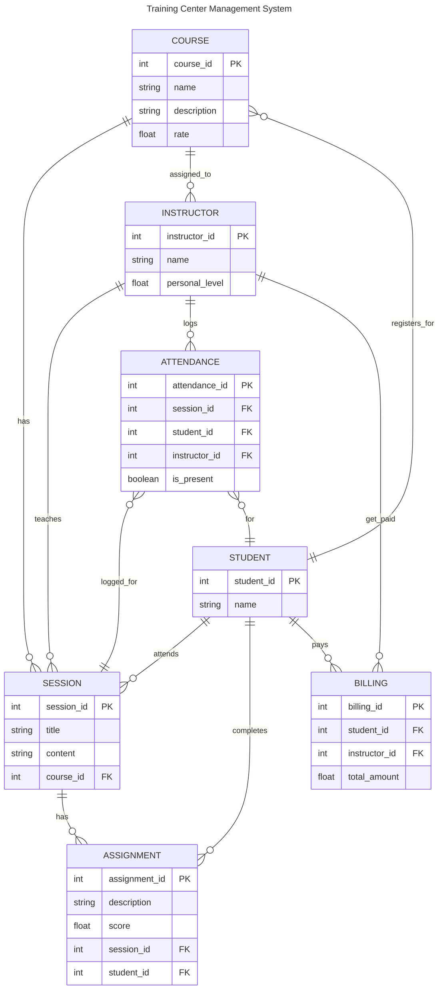

<head>
    <link rel="stylesheet" href="styles.css">
</head>

# Team 10: Training-Center-Management-System

Table of Contents

1. [Introduction :star:](#introduction)
2. [Team Members :man_technologist:](#team-members)
3. [Database Design :computer:](#training-center-management-system-database-design)

## Introduction
A project to turn in to a lecturer for the Database Design course at [HUST_Hanoi University of Science and Technology :school:](https://hust.edu.vn/) 

## Team Members
* [Nguyễn Trung Sơn _ 1624758 :man:](https://github.com/SadNguyen2107)
* [Nguyễn Văn Trí _ 1624782 :man:](https://github.com/TGaDev203)

## Training Center Management System Database Design
